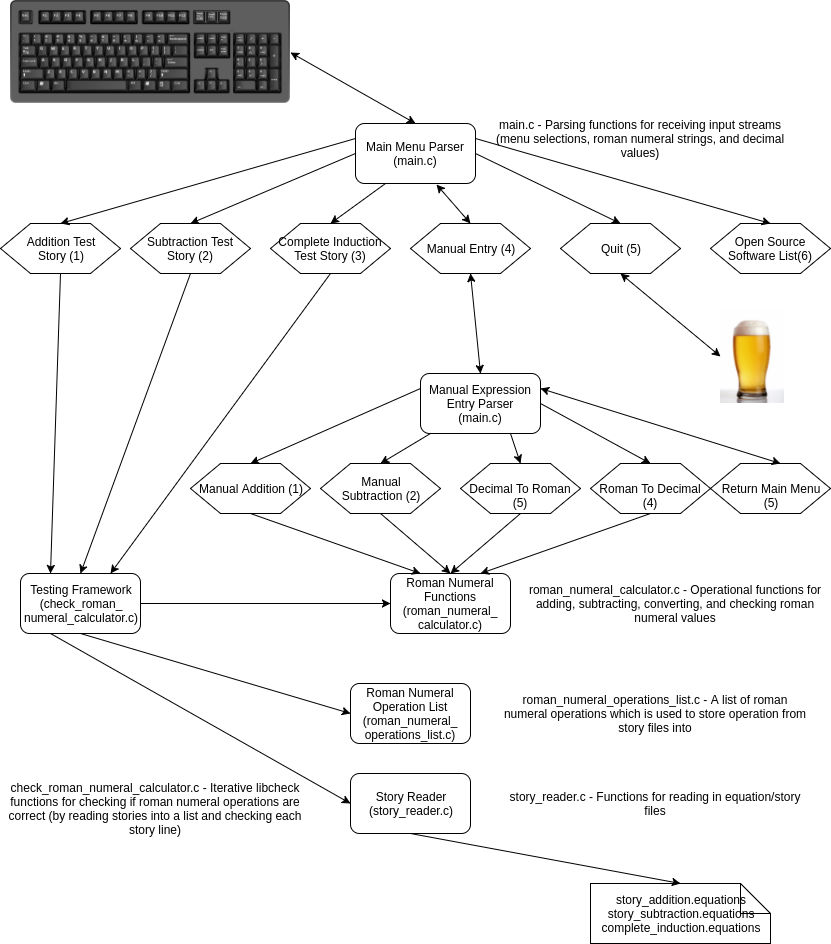

# Roman Numeral Calculator Kata
This is a programming exercise which demonstrates how to add and subtract roman numeral values from each other using a test driven development process.  This program incorporates the use of check unit testing framework ( https://libcheck.github.io/check/ ) for doing test driven development.

### Installation
This exercise requires
* Ubuntu Linux 14.04 (or similar)
* GNU GCC compiler tool chain
* GNU Make
* Check unit testing framework ( https://libcheck.github.io/check/ )
* git
* other required dependences for the tools listed above


On my system, I had to install these dependencies:

```sh
$ sudo apt-get install check subunit libsubunit-dev
```

If any of these libraries are missing from your system, they must be located and installed:
* libcheck
* libsubunit  
* libm
* librt
* libpthread


### Downloading/Building Instructions
Open a terminal

```sh
$ git clone https://github.com/nathan546/roman-numeral-kata.git
$ cd roman-numeral-kata/
$ make
$ cd build
$ ./romanNumeralCalculator
```
Note: The romanNumeralCalculator binary must be run with the following files in the same directory:
* complete_induction.equations
* story_addition.equations
* story_subtraction.equations

### Software Architecture



### Example Application Usage
```sh
$ ./romanNumeralCalculator 

Main Menu - Roman Numeral Calculator Kata Exercise
	1) Run Addition Test Story
	2) Run Subtraction Test Story
	3) Run Complete Induction Test Story
	4) Manually Enter Roman Numeral Expression
	5) Quit
	6) Open Source Software List

Enter Option From Menu: 4

Manual Menu - Manual Operations
	1) Run Roman Numeral Addition Calculation
	2) Run Roman Numeral Subtraction Calculation
	3) Run Decimal to Roman Numeral Converter
	4) Run Roman Numeral to Decimal Converter 
	5) Return to main menu

Enter Option From Manual Menu: 1
Input Operand 1: II
Input Operand 2: II

Result: II + II = IV

Enter Option From Manual Menu: 2
Input Operand 1: III
Input Operand 2: I

Result: III - I = II

Enter Option From Manual Menu: 3
Input Decimal Integer: 987

Result: 987 is CMLXXXVII in roman numerals

Enter Option From Manual Menu: 4
Input Roman Numeral: MCXL

Result: MCXL is 1140 in decimal
```

## Roman Numeral rules (from original Kata):

* Roman numerals consist of the following letters: I, V, X, L, C, D, and M which mean one, five, ten, fifty, hundred, five hundred and one thousand respectively.
* An example would be "XIV" + "LX" = "LXXIV" 
* Numerals can be concatenated to form a larger numeral ("XX" + "II" = "XXII").
* If a lesser numeral is put before a bigger it means subtraction of the lesser from the bigger ("IV" means four, "CM" means ninehundred).
* If the numeral is I, X or C you can't have more than three ("II" + "II" = "IV" not “IIII”).
* If the numeral is V, L or D you can't have more than one ("D" + "D" = "M" not “DD”)
* The maximum roman numeral is 3999 (MMMCMXCIX) 

## Stories (from original Kata):

### User Story: Addition
As a Roman bookkeeper, I want to be able to add two numbers together; so that I can do my work faster with fewer mathematical errors. 


### User Story: Subtraction 
As a Roman bookkeeper, I want to be able to subtract one number from another; so that I can do my work faster and with fewer mathematical errors.